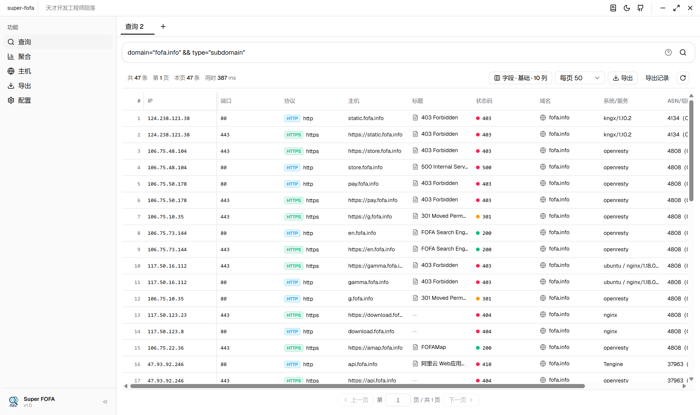
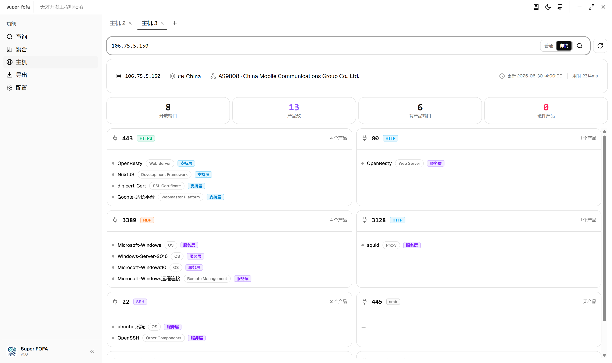
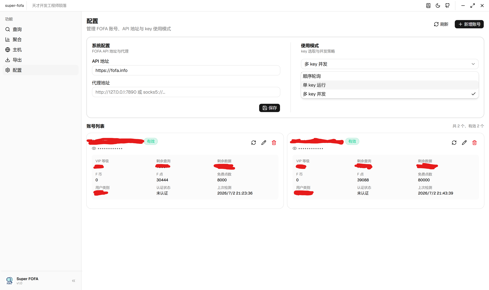

# super-fofa

> 高效的 FOFA API 桌面客户端 —— 查询、主机画像、聚合统计、批量导出、多 Key 管理于一体。

基于 Wails v2 + React + shadcn-ui 构建的跨平台桌面应用，把 FOFA 的能力包装成一个顺手、快速、可视化的本地工具，告别浏览器里反复拼语法和翻页。

## ✨ 特性

- **资产搜索**：多标签页查询、字段预设、历史记录、分页、端口/主机联动、一键转导出
- **主机画像**：IPv4 主机画像查询，普通 / 详情双模式，仪表盘式布局（Hero 卡 + KPI + 端口卡片）
- **聚合统计**：按字段聚合统计（持续完善中）
- **批量导出**：多语法 / IP / host / domain 输入、字段选择、断点续传、暂停 / 恢复 / 重试、XLSX 输出
- **多 Key 管理**：多账号管理、顺序 / 单 Key / 多 Key 模式、BaseURL / 代理配置、账号联网检测
- **跨平台**：macOS（Intel / Apple Silicon）、Windows（x64 / ARM64）
- **明暗主题**：跟随系统或手动切换，所有界面自适应
- **离线友好**：本地 SQLite 持久化任务 / 账号 / 配置，查询历史本地存储

## 📦 下载安装

前往 [Releases](https://github.com/polite-007/superfofa/releases/latest) 下载对应平台的压缩包：

| 平台 | 文件 |
|---|---|
| macOS（Apple Silicon） | `superfofa-macos-arm64.zip` |
| macOS（Intel） | `superfofa-macos-amd64.zip` |
| Windows（x64） | `superfofa-windows-amd64.zip` |
| Windows（ARM64） | `superfofa-windows-arm64.zip` |

**macOS**：解压后把 `superfofa.app` 拖到「应用程序」文件夹。首次打开若被 Gatekeeper 拦截，右键 → 打开 一次即可。

**Windows**：解压后运行 `superfofa.exe`。若被 SmartScreen 拦截，点击「更多信息」→「仍要运行」。

## 🖼 功能预览

> 截图位于 `screenshots/` 目录，可随版本更新替换。

### 资产搜索

多标签页查询、字段预设、历史记录、分页、端口 / 主机 / 导出联动。

### 主机画像

IPv4 主机画像查询，普通 / 详情双模式，仪表盘式布局。

### 聚合统计

按字段聚合统计，快速洞察资产分布。

### 批量导出

多输入源、字段选择、断点续传、暂停 / 恢复 / 重试，XLSX 输出。

### 多 Key 管理

多账号管理、顺序 / 单 Key / 多 Key 模式、代理配置、联网检测。

## 🚀 快速开始

1. 打开应用，进入「配置」页
2. 点击「新增账号」，填入 FOFA Email + API Key，点击「检测」确认可用
3. 回到「查询」页，输入 FOFA 语法开始搜索
4. 在结果中点击 IP 跳转主机画像，或点击「导出」批量拉取数据

> 没有可用账号时，查询会自动跳转到配置页引导你添加。

## 🛠 技术栈

- **前端**：React 18 + TypeScript + shadcn-ui + Tailwind CSS v4
- **后端**：Go 1.25 + Wails v2
- **FOFA SDK**：[github.com/polite-007/toolbox/fofa](https://github.com/polite-007/toolbox)
- **存储**：SQLite（账号 / 配置 / 导出任务）+ localStorage（查询历史）

## 💡 使用提示

- 详情模式（主机画像 `detail=true`）响应缓慢，常超时，请耐心等待
- 多 Key 模式适合大数据量导出，可分片并发拉取
- 查询语法与 FOFA 官方一致，支持 `&&`、`||`、字段过滤等

## 📝 更新日志

每个版本的功能与改动见 [Releases](https://github.com/polite-007/superfofa/releases)，应用内标题栏点击「日志」图标也可查看。

## 📄 说明

本仓库仅托管 README 与发布产物，源码暂未公开。如有建议或问题，欢迎通过 [Issues](https://github.com/polite-007/superfofa/issues) 反馈。

## 🙏 致谢

- [Wails](https://wails.io/) —— Go + Web 的桌面应用框架
- [shadcn-ui](https://ui.shadcn.com/) —— 组件库
- [polite-007/toolbox](https://github.com/polite-007/toolbox) —— FOFA Go SDK
